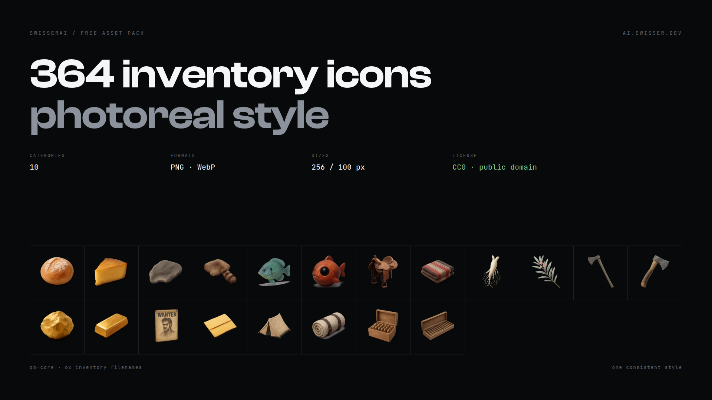

# RedM Inventory Icons — Photoreal 3D

364 inventory item icons for RedM in one consistent photoreal 3d style,
on transparent backgrounds, across 10 categories. CC0, so use them for
anything including paid servers, no credit needed.

Filenames follow RSG-Core naming where an equivalent exists.

## Download

| | | |
| --- | --- | --- |
| **Everything** | 364 icons | [`redm-icons-photoreal-v1.0.zip`](https://github.com/SwisserDev/redm-icons-photoreal/releases/download/v1.0/redm-icons-photoreal-v1.0.zip) |

Or take single files straight out of [`png-256/`](png-256). No archive, no account.

## Install

```bash
cp -r png-256/*/*.png resources/[rsg]/rsg-inventory/html/images/
```

Icons are grouped into category folders, so copy through the wildcard rather
than the folders themselves. For a custom item, point its `image` field at the
matching filename.

## Formats

| Folder | Size | Use |
| --- | --- | --- |
| [`png-256/`](png-256) | 256×256 PNG | The main set, transparent. What most inventories want. |
| [`webp-256/`](webp-256) | 256×256 WebP | Same icons, roughly 70% smaller. |
| [`webp-100/`](webp-100) | 100×100 WebP | Game-native size, smallest download for players. |

`items.json` lists every icon with its category and label.

## What's in it

<details>
<summary><b>Provisions</b> (61 icons)</summary>

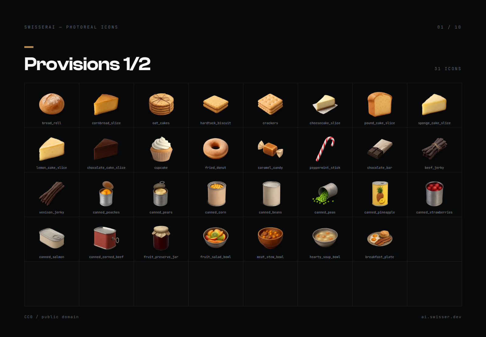

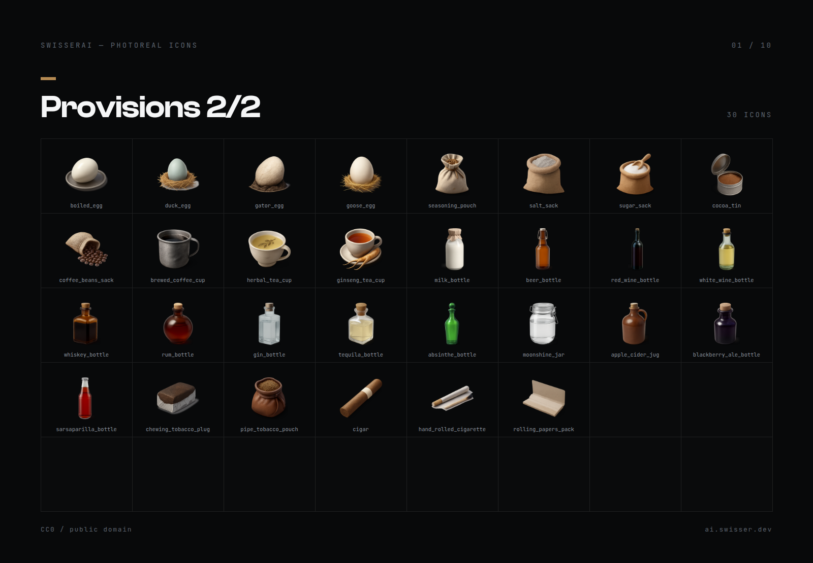

`bread_roll` · `cornbread_slice` · `oat_cakes` · `hardtack_biscuit` · `crackers` · `cheesecake_slice` · `pound_cake_slice` · `sponge_cake_slice` · `lemon_cake_slice` · `chocolate_cake_slice` · `cupcake` · `fried_donut` · `caramel_candy` · `peppermint_stick` · `chocolate_bar` · `beef_jerky` · `venison_jerky` · `canned_peaches` · `canned_pears` · `canned_corn` · `canned_beans` · `canned_peas` · `canned_pineapple` · `canned_strawberries` · `canned_salmon` · `canned_corned_beef` · `fruit_preserve_jar` · `fruit_salad_bowl` · `meat_stew_bowl` · `hearty_soup_bowl` · `breakfast_plate` · `boiled_egg` · `duck_egg` · `gator_egg` · `goose_egg` · `seasoning_pouch` · `salt_sack` · `sugar_sack` · `cocoa_tin` · `coffee_beans_sack` · `brewed_coffee_cup` · `herbal_tea_cup` · `ginseng_tea_cup` · `milk_bottle` · `beer_bottle` · `red_wine_bottle` · `white_wine_bottle` · `whiskey_bottle` · `rum_bottle` · `gin_bottle` · `tequila_bottle` · `absinthe_bottle` · `moonshine_jar` · `apple_cider_jug` · `blackberry_ale_bottle` · `sarsaparilla_bottle` · `chewing_tobacco_plug` · `pipe_tobacco_pouch` · `cigar` · `hand_rolled_cigarette` · `rolling_papers_pack`

</details>

<details>
<summary><b>Hunting</b> (58 icons)</summary>

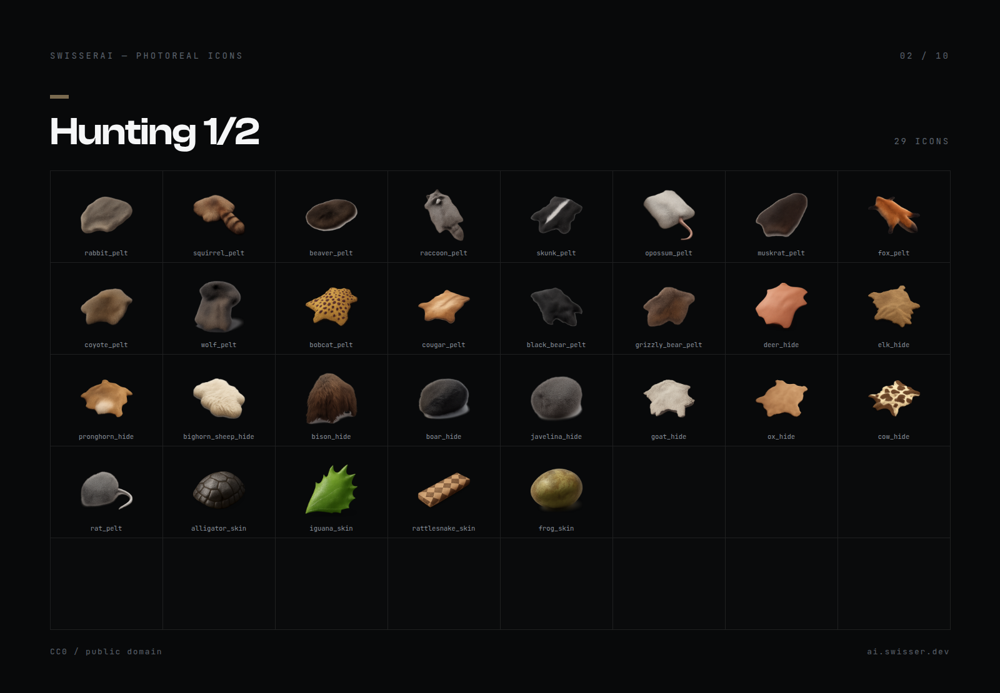

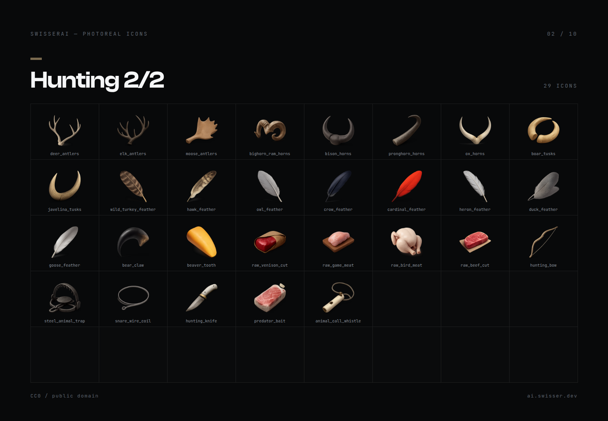

`rabbit_pelt` · `squirrel_pelt` · `beaver_pelt` · `raccoon_pelt` · `skunk_pelt` · `opossum_pelt` · `muskrat_pelt` · `fox_pelt` · `coyote_pelt` · `wolf_pelt` · `bobcat_pelt` · `cougar_pelt` · `black_bear_pelt` · `grizzly_bear_pelt` · `deer_hide` · `elk_hide` · `pronghorn_hide` · `bighorn_sheep_hide` · `bison_hide` · `boar_hide` · `javelina_hide` · `goat_hide` · `ox_hide` · `cow_hide` · `rat_pelt` · `alligator_skin` · `iguana_skin` · `rattlesnake_skin` · `frog_skin` · `deer_antlers` · `elk_antlers` · `moose_antlers` · `bighorn_ram_horns` · `bison_horns` · `pronghorn_horns` · `ox_horns` · `boar_tusks` · `javelina_tusks` · `wild_turkey_feather` · `hawk_feather` · `owl_feather` · `crow_feather` · `cardinal_feather` · `heron_feather` · `duck_feather` · `goose_feather` · `bear_claw` · `beaver_tooth` · `raw_venison_cut` · `raw_game_meat` · `raw_bird_meat` · `raw_beef_cut` · `hunting_bow` · `steel_animal_trap` · `snare_wire_coil` · `hunting_knife` · `predator_bait` · `animal_call_whistle`

</details>

<details>
<summary><b>Fishing</b> (30 icons)</summary>

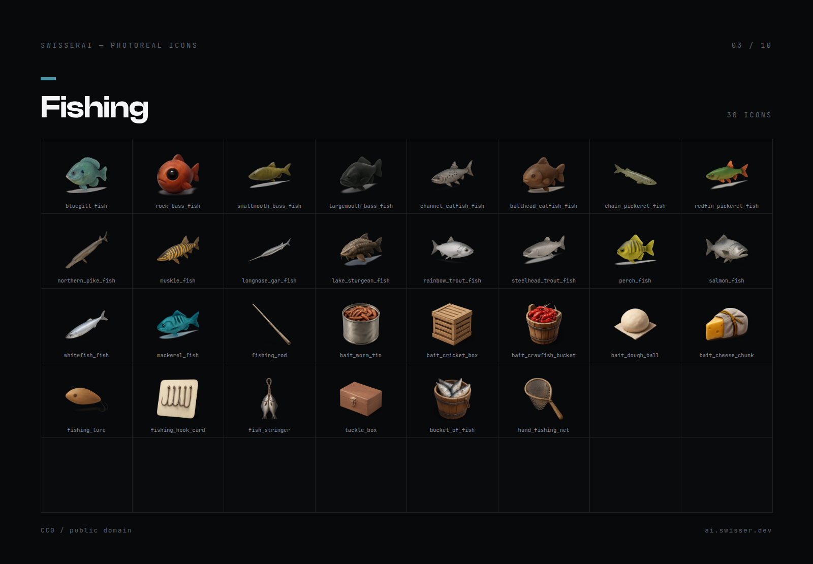

`bluegill_fish` · `rock_bass_fish` · `smallmouth_bass_fish` · `largemouth_bass_fish` · `channel_catfish_fish` · `bullhead_catfish_fish` · `chain_pickerel_fish` · `redfin_pickerel_fish` · `northern_pike_fish` · `muskie_fish` · `longnose_gar_fish` · `lake_sturgeon_fish` · `rainbow_trout_fish` · `steelhead_trout_fish` · `perch_fish` · `salmon_fish` · `whitefish_fish` · `mackerel_fish` · `fishing_rod` · `bait_worm_tin` · `bait_cricket_box` · `bait_crawfish_bucket` · `bait_dough_ball` · `bait_cheese_chunk` · `fishing_lure` · `fishing_hook_card` · `fish_stringer` · `tackle_box` · `bucket_of_fish` · `hand_fishing_net`

</details>

<details>
<summary><b>Horse Tack</b> (30 icons)</summary>

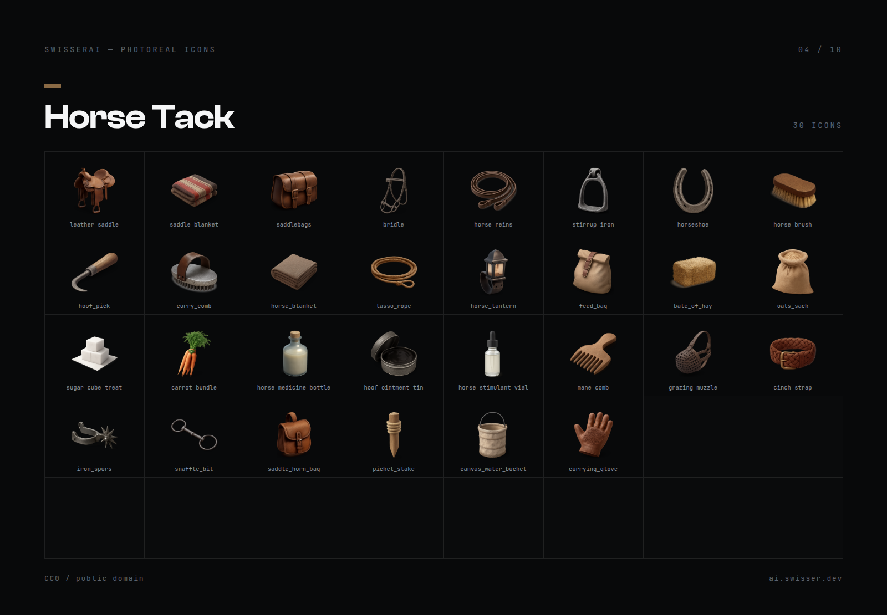

`leather_saddle` · `saddle_blanket` · `saddlebags` · `bridle` · `horse_reins` · `stirrup_iron` · `horseshoe` · `horse_brush` · `hoof_pick` · `curry_comb` · `horse_blanket` · `lasso_rope` · `horse_lantern` · `feed_bag` · `bale_of_hay` · `oats_sack` · `sugar_cube_treat` · `carrot_bundle` · `horse_medicine_bottle` · `hoof_ointment_tin` · `horse_stimulant_vial` · `mane_comb` · `grazing_muzzle` · `cinch_strap` · `iron_spurs` · `snaffle_bit` · `saddle_horn_bag` · `picket_stake` · `canvas_water_bucket` · `currying_glove`

</details>

<details>
<summary><b>Medicine & Tonics</b> (45 icons)</summary>

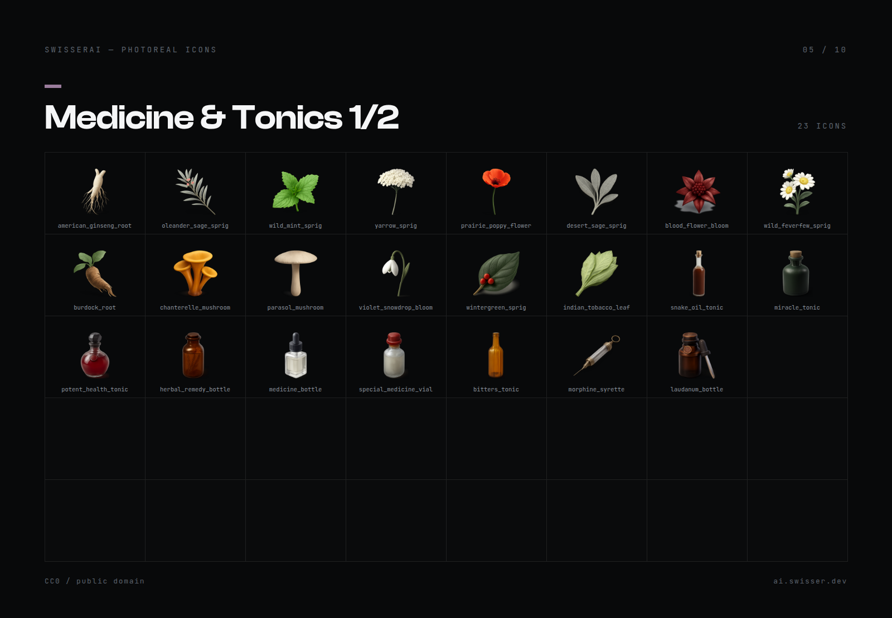

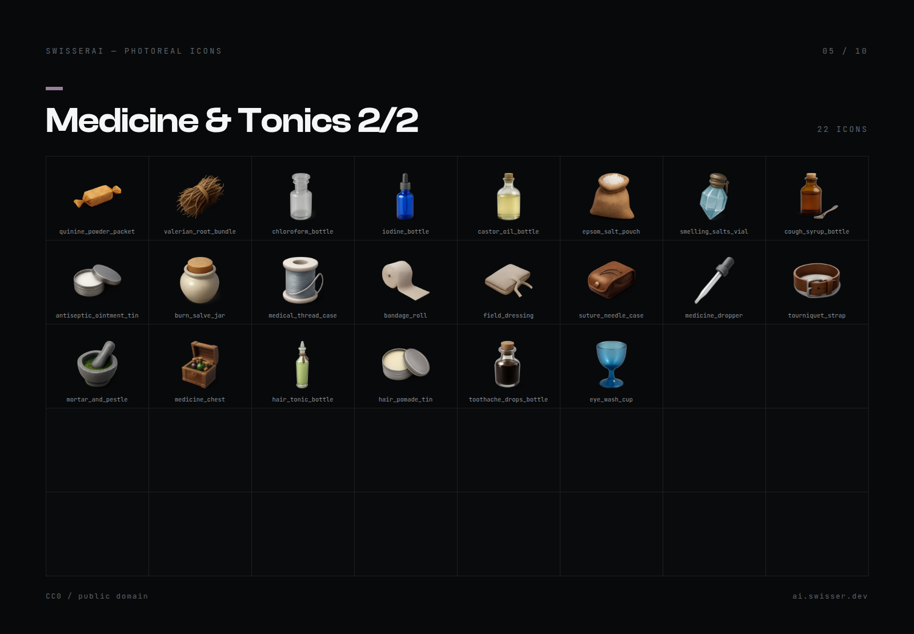

`american_ginseng_root` · `oleander_sage_sprig` · `wild_mint_sprig` · `yarrow_sprig` · `prairie_poppy_flower` · `desert_sage_sprig` · `blood_flower_bloom` · `wild_feverfew_sprig` · `burdock_root` · `chanterelle_mushroom` · `parasol_mushroom` · `violet_snowdrop_bloom` · `wintergreen_sprig` · `indian_tobacco_leaf` · `snake_oil_tonic` · `miracle_tonic` · `potent_health_tonic` · `herbal_remedy_bottle` · `medicine_bottle` · `special_medicine_vial` · `bitters_tonic` · `morphine_syrette` · `laudanum_bottle` · `quinine_powder_packet` · `valerian_root_bundle` · `chloroform_bottle` · `iodine_bottle` · `castor_oil_bottle` · `epsom_salt_pouch` · `smelling_salts_vial` · `cough_syrup_bottle` · `antiseptic_ointment_tin` · `burn_salve_jar` · `medical_thread_case` · `bandage_roll` · `field_dressing` · `suture_needle_case` · `medicine_dropper` · `tourniquet_strap` · `mortar_and_pestle` · `medicine_chest` · `hair_tonic_bottle` · `hair_pomade_tin` · `toothache_drops_bottle` · `eye_wash_cup`

</details>

<details>
<summary><b>Frontier Tools</b> (35 icons)</summary>

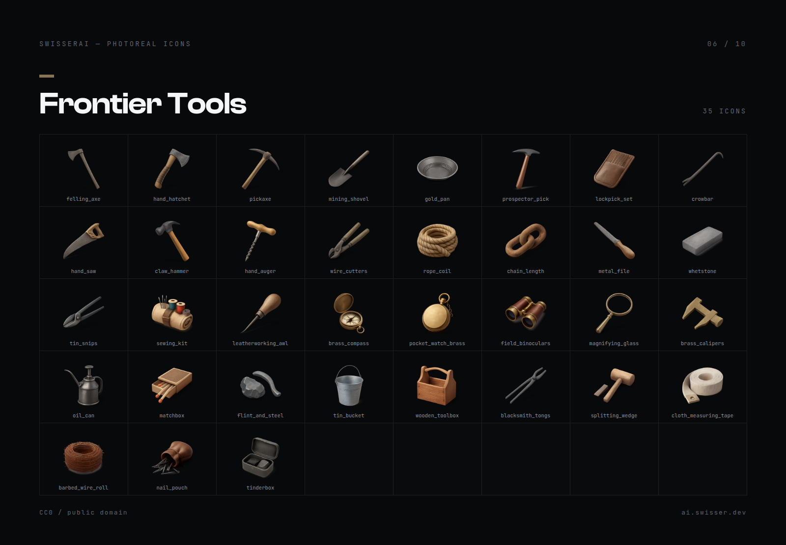

`felling_axe` · `hand_hatchet` · `pickaxe` · `mining_shovel` · `gold_pan` · `prospector_pick` · `lockpick_set` · `crowbar` · `hand_saw` · `claw_hammer` · `hand_auger` · `wire_cutters` · `rope_coil` · `chain_length` · `metal_file` · `whetstone` · `tin_snips` · `sewing_kit` · `leatherworking_awl` · `brass_compass` · `pocket_watch_brass` · `field_binoculars` · `magnifying_glass` · `brass_calipers` · `oil_can` · `matchbox` · `flint_and_steel` · `tin_bucket` · `wooden_toolbox` · `blacksmith_tongs` · `splitting_wedge` · `cloth_measuring_tape` · `barbed_wire_roll` · `nail_pouch` · `tinderbox`

</details>

<details>
<summary><b>Valuables</b> (25 icons)</summary>

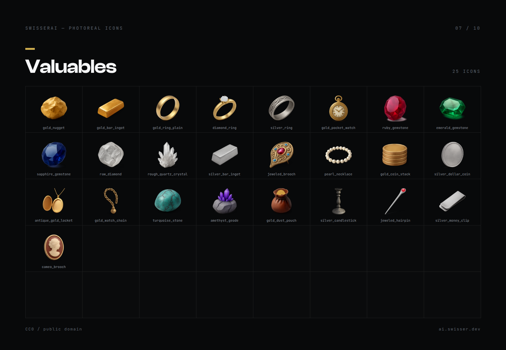

`gold_nugget` · `gold_bar_ingot` · `gold_ring_plain` · `diamond_ring` · `silver_ring` · `gold_pocket_watch` · `ruby_gemstone` · `emerald_gemstone` · `sapphire_gemstone` · `raw_diamond` · `rough_quartz_crystal` · `silver_bar_ingot` · `jeweled_brooch` · `pearl_necklace` · `gold_coin_stack` · `silver_dollar_coin` · `antique_gold_locket` · `gold_watch_chain` · `turquoise_stone` · `amethyst_geode` · `gold_dust_pouch` · `silver_candlestick` · `jeweled_hairpin` · `silver_money_clip` · `cameo_brooch`

</details>

<details>
<summary><b>Documents</b> (25 icons)</summary>

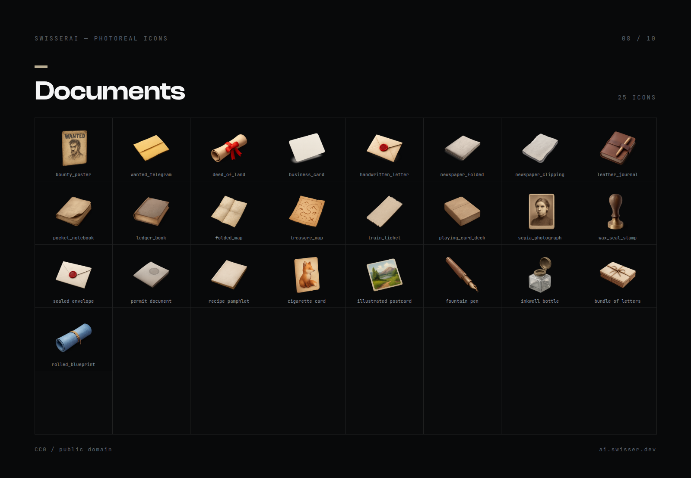

`bounty_poster` · `wanted_telegram` · `deed_of_land` · `business_card` · `handwritten_letter` · `newspaper_folded` · `newspaper_clipping` · `leather_journal` · `pocket_notebook` · `ledger_book` · `folded_map` · `treasure_map` · `train_ticket` · `playing_card_deck` · `sepia_photograph` · `wax_seal_stamp` · `sealed_envelope` · `permit_document` · `recipe_pamphlet` · `cigarette_card` · `illustrated_postcard` · `fountain_pen` · `inkwell_bottle` · `bundle_of_letters` · `rolled_blueprint`

</details>

<details>
<summary><b>Camp</b> (30 icons)</summary>

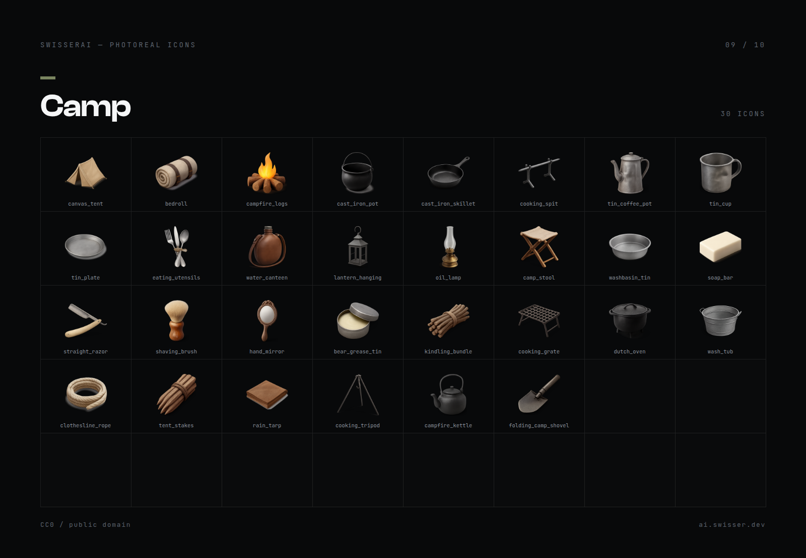

`canvas_tent` · `bedroll` · `campfire_logs` · `cast_iron_pot` · `cast_iron_skillet` · `cooking_spit` · `tin_coffee_pot` · `tin_cup` · `tin_plate` · `eating_utensils` · `water_canteen` · `lantern_hanging` · `oil_lamp` · `camp_stool` · `washbasin_tin` · `soap_bar` · `straight_razor` · `shaving_brush` · `hand_mirror` · `bear_grease_tin` · `kindling_bundle` · `cooking_grate` · `dutch_oven` · `wash_tub` · `clothesline_rope` · `tent_stakes` · `rain_tarp` · `cooking_tripod` · `campfire_kettle` · `folding_camp_shovel`

</details>

<details>
<summary><b>Firearms Accessories</b> (25 icons)</summary>

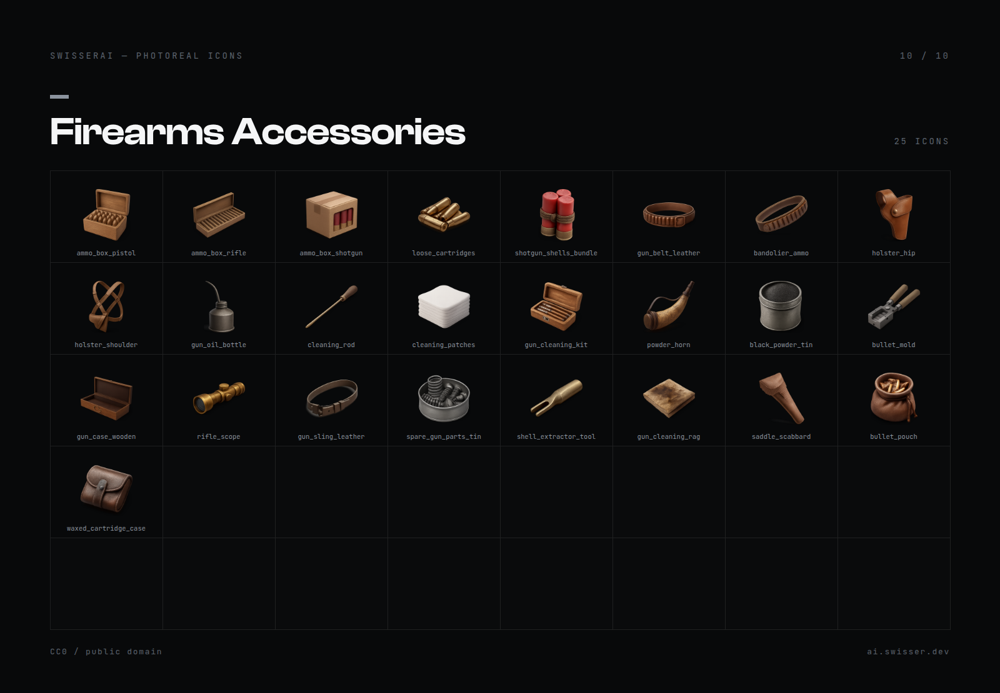

`ammo_box_pistol` · `ammo_box_rifle` · `ammo_box_shotgun` · `loose_cartridges` · `shotgun_shells_bundle` · `gun_belt_leather` · `bandolier_ammo` · `holster_hip` · `holster_shoulder` · `gun_oil_bottle` · `cleaning_rod` · `cleaning_patches` · `gun_cleaning_kit` · `powder_horn` · `black_powder_tin` · `bullet_mold` · `gun_case_wooden` · `rifle_scope` · `gun_sling_leather` · `spare_gun_parts_tin` · `shell_extractor_tool` · `gun_cleaning_rag` · `saddle_scabbard` · `bullet_pouch` · `waxed_cartridge_case`

</details>

## Other styles

Same catalogue, different look. Pick the one that matches your inventory UI:

- [Photoreal 3D](https://github.com/SwisserDev/redm-icons-photoreal) — you are here
- [Drawn Artwork](https://github.com/SwisserDev/redm-icons-artwork)
- [Outlined Flat](https://github.com/SwisserDev/redm-icons-outline)
- [Flat Minimal](https://github.com/SwisserDev/redm-icons-minimal)
- [Monochrome](https://github.com/SwisserDev/redm-icons-monochrome)
- [Pixel Art](https://github.com/SwisserDev/redm-icons-pixel)
- [Neon Cyberpunk](https://github.com/SwisserDev/redm-icons-neon)
- [Retro Print](https://github.com/SwisserDev/redm-icons-retro)

## Notes

The icons are AI generated, then run through a fixed normalisation pass: tight
alpha crop ignoring the drop shadow, uniform fill ratio, centred on a square
canvas. That is why they sit the same way in a slot instead of jumping around in
size.

No real-world trademarks are depicted. Where an item would normally reference a
brand, it uses a generic period equivalent.

## License

[CC0 1.0 Universal](LICENSE), public domain. Use them, change them, ship them on
a paid server, redistribute them. No attribution needed.

---

Made with [SwisserAI](https://ai.swisser.dev), AI asset tools for RedM.
